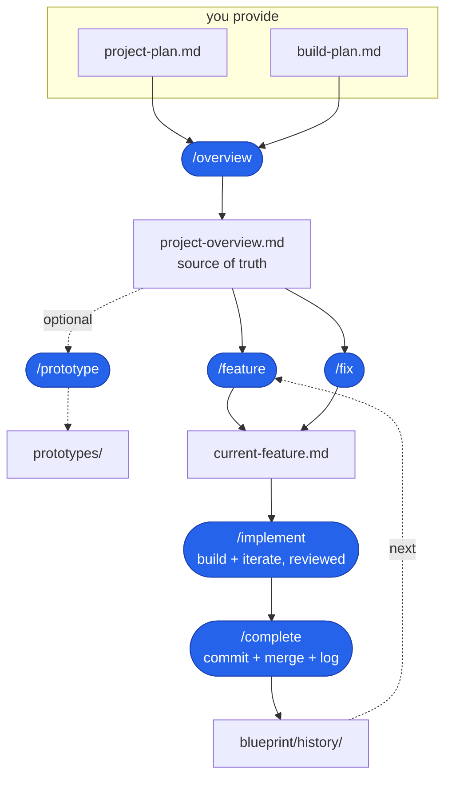

# AI Coding Blueprint

A starter and a repeatable process for building real software with an AI
assistant, **without vibe coding**.

You provide two short planning docs. They're the source everything else flows
from. Write them yourself or let the AI help you draft and flesh them out; what
matters is that you own and direct what's in them, not that you type every
character. Everything downstream (the project overview, every feature spec) is
then *generated* from them by skills. You build one feature at a time, reviewing
every diff before it lands.

## Why this exists

"Vibe coding" is describing a vague thing and accepting whatever the AI returns.
It's fast until it isn't: you end up with code nobody understands and a project
that can't be changed safely.

This blueprint is the opposite. It keeps the AI on a leash with three gates:

1. **Spec before code.** The skills *plan and stop*. You read the spec before a
   single line of code exists.
2. **Small, reviewable steps.** Each step ends with something working and a diff
   small enough to read in full, explained in plain English with its done-when
   proven before you approve it. If a diff is too big to review, the step was too
   big, so split it.
3. **One feature at a time.** `blueprint/context/current-feature.md` holds exactly one
   feature. Finish it, archive it, move on.

The point isn't to type less. It's to stay in control of a codebase the AI is
helping you write.

## The pipeline



## Starting a new project

Scaffold the app first (any stack), then overlay the blueprint on top.

**1. Scaffold your app** in a new, empty directory:

```bash
npx create-next-app@latest my-app
cd my-app
```

**2. Add the blueprint** (run inside the app):

```bash
npx degit bradtraversy/ai-blueprint . --force
```

This drops in `AGENTS.md`, `CLAUDE.md`, `.claude/`, and the `blueprint/` folder. Prefer a local copy instead of `degit`? Run:

```bash
cp -R path/to/ai-blueprint/{AGENTS.md,CLAUDE.md,.claude,blueprint} .
```

**3. Plan, then build.** Fill in `blueprint/project-plan.md` and `blueprint/build-plan.md`, then run the skills (`/overview` -> `/feature` -> `/implement` -> `/complete`). See [The workflow, step by step](#the-workflow-step-by-step) below.

Scaffolders like `create-next-app` need an empty folder, which is why the app
comes first and the blueprint is overlaid second. `degit` replaces the app's
boilerplate README with the blueprint's; rename or swap in your own when you're
ready (the `cp` alternative leaves your README in place).

## You provide two files

| File | What it is |
| ---- | ---------- |
| [blueprint/project-plan.md](blueprint/project-plan.md) | The **what & why**: problem, users, features, data, tech, monetization, UI/UX. Answer each section in a line or two. A worksheet, not an essay. |
| [blueprint/build-plan.md](blueprint/build-plan.md) | The **ordered feature list**: one line per feature, rough build order. No detail; that comes later, per feature. |

These two are the only inputs you maintain. Draft them yourself or with the AI's
help: brainstorm with it, expand a terse idea into full sentences, tighten the
wording, whatever's useful. Your job is to *decide and own* what goes in; the AI
is a fine partner for the actual writing. Keep them current; everything else
regenerates from them.

## Everything else is generated

| File | Generated by | What it is |
| ---- | ------------ | ---------- |
| [blueprint/context/project-overview.md](blueprint/context/project-overview.md) | `/overview` | The single source of truth the AI reads every session: the two plans distilled into one coherent doc with a concrete data model. |
| [blueprint/context/current-feature.md](blueprint/context/current-feature.md) | `/feature` | The detailed, buildable spec for the **one** feature you're building right now, with build steps `/implement` checks off as it goes (so progress survives a context clear). |
| `blueprint/history/features/NN-name.md` | `/complete` | The archive of finished feature specs, your build history. |

## The workflow, step by step

**Set up (once)**

- **Scaffold your app first**, in an empty directory, however you like:
  `npx create-next-app@latest my-app` (or Vite, Astro, a Python project, etc.).
  Tools like `create-next-app` require an empty folder, so the app comes before
  the blueprint, not after.
- **Overlay the blueprint.** From inside the app, run one command:
  `npx degit bradtraversy/ai-blueprint . --force`. It drops in `AGENTS.md`,
  `CLAUDE.md`, `.claude/`, and the `blueprint/` folder, and replaces the boilerplate
  README with the blueprint's. Prefer a local copy? Use:
  `cp -R path/to/ai-blueprint/{AGENTS.md,CLAUDE.md,.claude,blueprint} .`
- **Tune the conventions.** Edit
  [blueprint/context/coding-standards.md](blueprint/context/coding-standards.md) to match your stack
  (it ships with sensible Next.js + TypeScript + Prisma defaults); skim
  [blueprint/context/ai-interaction.md](blueprint/context/ai-interaction.md) for how the AI works with
  you.

**Plan the project**

1. Fill in [blueprint/project-plan.md](blueprint/project-plan.md) and
   [blueprint/build-plan.md](blueprint/build-plan.md).
2. Run **`/overview`**. It distills both plans into `blueprint/context/project-overview.md`
   and reports any contradictions or gaps under an **Open questions** section.
3. Answer those open questions **in the plans**, then re-run `/overview`. Repeat
   until the section is empty. (Fix the plans, not the overview; the overview is
   generated.)

**Build, feature by feature.** Repeat for each item in the build plan:

4. Run **`/feature`**. With no number it specs the **next unchecked** item in the
   build plan; pass a number or name (`/feature 3`, `/feature "login"`) to pick a
   specific one. It sizes the feature, splits anything too big into smaller
   sub-features, and writes a step-by-step spec to `blueprint/context/current-feature.md`.
   Then it stops.
5. **Read the spec.** Adjust anything before code is written. This is your review
   gate.
6. **Run `/implement`** to build it, one reviewed step at a time. It branches,
   then for each step: build, show the diff, explain it and **confirm the done-when
   with evidence** (build output, a screenshot), test if the project has a runner,
   and **iterate until it works** (re-prompt or hand-edit). After each approved step
   it pops a quick choice - **continue**, **commit a checkpoint**, **walk me through
   it** (a deeper code explanation), or **stop here** - so checkpoints stay optional.
   It checks each step off in `current-feature.md` as it goes, so you can clear
   context mid-feature and resume from the first unchecked step. It builds on the
   branch only.
7. **Run `/complete`** to wrap up: it archives the spec to
   `blueprint/history/features/NN-name.md`, checks the feature off in `build-plan.md`, resets
   `blueprint/context/current-feature.md` to its stub, makes **one feature-level commit**,
   then **squash-merges** to main (with your go-ahead) and deletes the branch, so
   the feature lands as a single clean commit.
8. Back to step 4 for the next feature.

**Fixes** (a bug or change that isn't a planned feature): run `/fix "<what's wrong>"`
instead of `/feature`, then `/implement` and `/complete` as usual. `/complete` logs
fixes to `blueprint/history/fixes/` rather than checking them off the build plan.

## Picking up where you left off

You don't need a separate save/load command. The blueprint keeps project state in
**files, not the conversation**, and `CLAUDE.md` re-loads them every session:

- `project-overview.md` - the source of truth
- `current-feature.md` - the in-progress spec, with each build step checked off as
  it's finished
- `build-plan.md` - what's done and what's next
- `blueprint/history/features/` and git - the history of everything built

So you can **clear context any time**. Between features it's effortless: the next
session reads the build plan, and you run `/feature` for the next item. Mid-feature,
`/implement` has been ticking off steps in `current-feature.md`, so a fresh session
(plus the git branch and working tree, which clearing context doesn't touch) picks
up from the first unchecked step - just run `/implement` again.

## File map

```
.                              (your app: src/, package.json, README.md, ...)
├── CLAUDE.md                  (Claude Code entry; imports AGENTS.md + context. Must be at root)
├── AGENTS.md                  (agent instructions; read by Codex, Cursor, etc. Must be at root)
├── .claude/
│   └── skills/                (the slash-command skills. Must be at root)
│       ├── overview/          (/overview: two plans to project-overview.md)
│       ├── feature/           (/feature: one build-plan item to current-feature.md)
│       ├── fix/               (/fix: document an ad-hoc bug fix or change)
│       ├── implement/         (/implement: build the current feature or fix, reviewed)
│       ├── complete/          (/complete: feature commit, squash-merge, log)
│       └── prototype/         (/prototype: static screen mockups, pre-build)
└── blueprint/                 (everything else the workflow needs, in one folder)
    ├── project-plan.md        (YOU write: what & why)
    ├── build-plan.md          (YOU write: ordered feature list)
    ├── context/               (what the AI loads every session)
    │   ├── project-overview.md  (generated by /overview)
    │   ├── coding-standards.md  (your conventions, edit once)
    │   ├── ai-interaction.md    (how the AI works with you)
    │   └── current-feature.md   (generated by /feature, one at a time)
    └── history/               (the build archive)
        ├── features/          (completed feature specs land here)
        └── fixes/             (completed fix specs land here)
```

`CLAUDE.md`, `AGENTS.md`, and `.claude/` have to stay at the repo root because the
tools that read them look there; everything else the workflow owns lives under the
single `blueprint/` folder, so it never clutters your app.

## The skills

| Skill | Run it | Does |
| ----- | ------ | ---- |
| **/overview** | after writing or editing the plans | Distills `project-plan.md` + `build-plan.md` into `blueprint/context/project-overview.md`. Re-run whenever the plans change. |
| **/feature** | for each feature you build | With no number, specs the **next unchecked** build-plan item; or pass a number/name. Sizes it, splits big ones into sub-features, writes a small-step spec to `blueprint/context/current-feature.md`, then stops. |
| **/fix** | for a bug or change not in the build plan | Documents an ad-hoc fix into `blueprint/context/current-feature.md` (lighter than a feature spec), then stops. Build it with `/implement`; `/complete` logs it to `blueprint/history/fixes/`. |
| **/implement** | after reviewing a feature spec | Builds `blueprint/context/current-feature.md` one small step at a time on a feature branch: a diff, a plain-English summary with the done-when proven, your approval each step, and a checkpoint choice (**continue / commit checkpoint / walk me through it / stop**). Checks each step off as it goes, so you can clear context and resume from the first unchecked step. The feature commit and merge are `/complete`'s job. |
| **/complete** | when a feature is built and reviewed | Logs the feature (archives the spec to `blueprint/history/features/`, checks it off `build-plan.md`, resets `current-feature.md`), makes **one feature-level commit**, then **squash-merges** to main with your go-ahead and deletes the branch. Never pushes without a yes. |
| **/prototype** | before the build loop, to lock the look | Asks about the look and which pages, proposes a plan, then writes throwaway static mockups to `prototypes/` sharing one theme (CSS variables). A pre-build helper, outside the feature loop. |

These commands are the structured path, not a cage. You can describe a feature,
fix, or change directly in chat at any time, and the same conventions still apply
(they're loaded from `blueprint/context/`). Reach for the skills when you want the repeatable
loop and the logging; prompt directly when you just want something done.

## A note on the app itself

This blueprint is a **workflow layer**, not an app skeleton, so there's no
`package.json` in it. You scaffold the app yourself first (with whatever you
like), then overlay these files on top, as in **Set up** above. That's what keeps
it stack-agnostic: the same process drives a Next.js app, a Vite SPA, or a Python
service. The defaults in `coding-standards.md` assume Next.js + TypeScript +
Tailwind + Prisma, but you can change them.

To keep the overlay conflict-free, the blueprint deliberately ships nothing a
fresh scaffold also creates: all content stays namespaced under `blueprint/` and
`.claude/`, plus `CLAUDE.md` and `AGENTS.md`. Don't add root files like `.gitignore`,
`tsconfig.json`, or `eslint.config.mjs` to the blueprint; let the framework
provide those, and append any blueprint-specific ignores during the first feature.

## A note on prototyping

Locking the look (mockups, Figma, v0, static HTML, AI artifacts) is exploratory,
throwaway work, and a poor fit for the spec-and-review feature loop. Do it before
the build loop and let the result inform the UI/UX section of your project plan.

The blueprint ships a `/prototype` helper for this: it asks about the look you
want and which pages to draft, proposes a plan, then writes static mockups to
`prototypes/`, all sharing one theme (CSS variables). Those
variables are the part that carries into the real build (into `globals.css`
`@theme`); the
mockups themselves are reference and get discarded. It's a pre-build helper, not a
feature, so don't list prototyping in the build plan.

## Works in other tools

The blueprint isn't Claude-specific. `AGENTS.md` is the cross-tool entry point that
Codex, Cursor, GitHub Copilot, Gemini CLI, Aider, and others read; the `blueprint/context/`
files and `.claude/skills/*/SKILL.md` are plain markdown any agent can read; and
`CLAUDE.md` just imports `AGENTS.md` so there's one source of truth. The native
`/slash-command` skills are a Claude Code convenience. In other tools, run a step
by asking the agent to follow the matching `SKILL.md` (for example, "run the
overview" -> `.claude/skills/overview/SKILL.md`).
