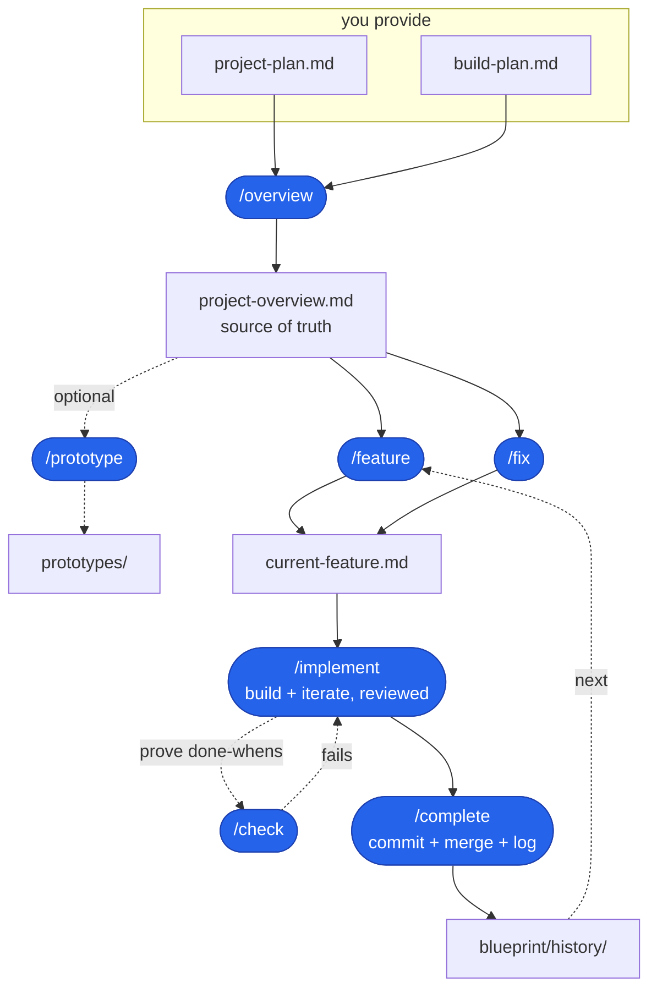

# AI Coding Blueprint

A starter and repeatable workflow for building real software with an AI assistant,
**without vibe coding**.

You provide two short planning docs. The AI turns them into project context,
feature specs, and build steps. You build one feature at a time, review every
spec before code exists, and review every diff before it lands.

## What this is

Vibe coding is describing a vague thing and accepting whatever the AI returns.
It is fast until it is not: you end up with code nobody understands and a project
that cannot be changed safely.

This blueprint gives the AI a controlled loop:

1. **Spec before code.** Planning skills write a spec and stop. You review it
   before a single line of code is written.
2. **Small, reviewable steps.** Each implementation step ends with something
   observable, a diff you can read, and proof that the done-when was met.
3. **One feature at a time.** `blueprint/context/current-feature.md` holds exactly
   one feature or fix. Finish it, archive it, then move on.

The point is not to type less. It is to stay in control of a codebase the AI is
helping you write.

## At a glance

| Principle | What it means |
| ---- | ---- |
| Spec first | The AI writes a feature or fix spec, then stops for review before code. |
| Small diffs | Implementation happens one reviewed step at a time, with proof each step works. |
| File-backed state | Plans, current work, and history live in markdown files, so context clears are survivable. |
| Tool adapters | Codex uses `.agents/skills`; Claude Code uses `.claude/skills`. |

## Quick start

Scaffold the app first, then overlay the blueprint on top.

> [!IMPORTANT]
> Scaffold your app first, then overlay the Blueprint. Do not run a framework
> scaffolder inside a folder that already contains Blueprint files.

**1. Scaffold your app** in a new, empty directory. Next.js is only an example
here; use any stack or scaffolder you want:

```bash
npx create-next-app@latest my-app
cd my-app
```

Make sure the app is a **git repo**. The build loop works on branches and
squash-merges. Some scaffolders run `git init` for you; if yours does not, run it
yourself:

```bash
git init
```

**2. Add the blueprint** from inside the app:

```bash
npx degit bradtraversy/ai-blueprint . --force
```

Prefer a local copy instead of `degit`?

```bash
cp -R path/to/ai-blueprint/{AGENTS.md,CLAUDE.md,.agents,.claude,blueprint} .
```

This drops in `AGENTS.md`, `CLAUDE.md`, `.agents/`, `.claude/`, and `blueprint/`.
Codex reads `.agents/skills`; Claude Code reads `.claude/skills`.

Only keep the adapter for the tool you use. Codex-only projects can delete
`CLAUDE.md` and `.claude/`. Claude Code-only projects can delete `.agents/`, but
should keep `AGENTS.md` because `CLAUDE.md` imports it.

### Which files do I need?

| Setup | Keep | Optional to delete |
| ---- | ---- | ---- |
| Codex only | `AGENTS.md`, `.agents/`, `blueprint/` | `CLAUDE.md`, `.claude/` |
| Claude Code only | `AGENTS.md`, `CLAUDE.md`, `.claude/`, `blueprint/` | `.agents/` |
| Codex and Claude Code | `AGENTS.md`, `CLAUDE.md`, `.agents/`, `.claude/`, `blueprint/` | Nothing |

> [!IMPORTANT]
> After the overlay, run `/onboard` before filling in plans or running
> `/overview`. This is the setup pass that makes the Blueprint match your actual
> project.

**3. Run onboard before anything else.** This detects the stack, updates the
Commands section of `AGENTS.md`, sets the `CLAUDE.md` project title when present,
tunes `coding-standards.md`, checks `.gitignore`, and confirms which tool
adapters you need:

```text
/onboard
```

In Codex, invoke it as `$onboard` or ask naturally, such as "run onboard."

**4. Review the setup.** Skim
[blueprint/context/coding-standards.md](blueprint/context/coding-standards.md) and
[blueprint/context/ai-interaction.md](blueprint/context/ai-interaction.md). Adjust
anything `/onboard` flagged or anything that does not match how you want to work.

**5. Plan the app.** Fill in the two files you own:

- [blueprint/project-plan.md](blueprint/project-plan.md)
- [blueprint/build-plan.md](blueprint/build-plan.md)

**6. Start the build loop.**

```text
/overview
/feature
/implement
/check
/complete
```

That path creates project context, specs the next feature, builds it, proves it
works, then archives and merges it.

In Codex, invoke the same workflow as skills (`$overview`, `$feature`,
`$implement`, `$check`, `$complete`) or ask naturally, such as "run the
overview." In Claude Code, use the slash commands shown above.

Most scaffolders need an empty folder, which is why the app comes first and the
blueprint is overlaid second. `degit` replaces the app's boilerplate README with
this one; the `cp` alternative leaves your README in place.

### Already have a codebase?

If the app already has meaningful shipped features, use `/adopt` instead of
`/onboard`. Overlay the blueprint files the same way, then run:

```text
/adopt
```

`/adopt` surveys the real repo, asks for the intent the code cannot reveal, then
generates the planning docs and coding standards from what already exists. Then
run `/overview` and continue through the normal build loop.

## The AI build loop

AI loops are popular because the assistant can plan, act, check the result, and
iterate. This blueprint turns that idea into a project workflow with human review
gates and a written history.

The main loop is:

```text
/feature -> review spec -> /implement -> /check -> /complete
```

For unplanned bugs or small changes, use the fix loop:

```text
/fix "what is wrong" -> review spec -> /implement -> /check -> /complete
```

In this repo, **the build loop** means:

- **`/feature`** selects the next planned feature and writes a buildable spec.
- **`/fix`** writes a smaller spec for an unplanned bug or change.
- **`/implement`** builds the current spec one reviewed step at a time.
- **`/check`** runs the real app and proves the done-whens.
- **`/complete`** archives the spec, commits the finished work, and merges with
  your approval.

The loop is the control system. The AI can keep iterating, but only inside the
current spec, with observable checks and review gates.



## The two files you own

| File | What it is |
| ---- | ---------- |
| [blueprint/project-plan.md](blueprint/project-plan.md) | The **what and why**: problem, users, features, data, tech, monetization, and UI/UX. Answer each section in a line or two. |
| [blueprint/build-plan.md](blueprint/build-plan.md) | The **ordered feature list**: one line per feature, in rough build order. No deep detail here. |

These two files are the inputs you maintain. Draft them yourself or with the AI.
Your job is to decide and own what goes in them. The AI can help with wording,
expansion, and tradeoffs.

> [!TIP]
> Keep these files short and decisive. The overview step will turn them into more
> concrete project context.

## What gets generated

| File | Generated by | What it is |
| ---- | ------------ | ---------- |
| [blueprint/context/project-overview.md](blueprint/context/project-overview.md) | `/overview` | The single source of truth the AI reads every session, generated from the two planning docs. |
| [blueprint/context/current-feature.md](blueprint/context/current-feature.md) | `/feature` or `/fix` | The spec for the one feature or fix being built right now, including build steps and done-whens. |
| `blueprint/history/features/NN-name.md` | `/complete` | The archive of finished feature specs. |
| `blueprint/history/fixes/NN-name.md` | `/complete` | The archive of finished fix specs. |

Fix the planning docs, then regenerate. Do not hand-edit generated context unless
the skill tells you to.

> [!WARNING]
> Treat generated context as downstream output. When the plan changes, update the
> planning docs and re-run the relevant skill instead of patching generated files
> by hand.

## Using the workflow

Start by running `/overview`. It distills the two planning docs into
`blueprint/context/project-overview.md` and reports contradictions or gaps under
**Open questions**. Answer those questions in the plans, then re-run `/overview`.

Then repeat the build loop for each feature:

1. Run **`/feature`** to spec the next unchecked build-plan item. You can also
   pass a number or name, such as `/feature 3` or `/feature "login"`.
2. Review `blueprint/context/current-feature.md` before code is written.
3. Run **`/implement`**. It branches, builds one step, shows the diff, proves the
   done-when, and waits for approval before moving on.
4. Run **`/check`** when you want an outside proof pass against the real app.
5. Run **`/complete`** when the feature is done. It archives the spec, checks off
   the build plan, commits the finished work, and squash-merges with your
   go-ahead.

### Fixes

Use `/fix` instead of `/feature`:

```text
/fix "password reset email never sends"
```

If you already described the problem in chat, `/fix` can use that context. It
needs an argument or clear problem statement; it does not scan the app and
magically know what to fix.

Then continue with `/implement`, `/check`, and `/complete`. Fixes are logged to
`blueprint/history/fixes/` and do not change `build-plan.md`.

## Command reference

| Skill | Run it | Does |
| ----- | ------ | ---- |
| **/onboard** | once, after overlaying onto a fresh or early project | Detects the stack, updates commands and conventions, checks `.gitignore`, and tells you what to fill in before `/overview`. |
| **/adopt** | once, for an existing codebase | Surveys the repo and generates the planning docs and coding standards from what already exists. |
| **/overview** | after writing or editing the plans | Generates `blueprint/context/project-overview.md` from the two planning docs. |
| **/feature** | for each planned feature | Specs the next unchecked feature, or a selected feature, into `current-feature.md`. |
| **/fix** | for an unplanned bug or small change | Specs an ad-hoc fix into `current-feature.md`. |
| **/implement** | after reviewing a spec | Builds the current spec one small, reviewed step at a time. |
| **/check** | before wrapping up, or any time you want proof | Runs the real app and reports pass/fail against the spec's done-whens. |
| **/complete** | when work is built and reviewed | Archives the spec, commits the finished work, and merges with your approval. |
| **/prototype** | before the build loop | Creates throwaway static mockups to explore the look and feel. |
| **/status** | any time | Shows build-plan progress, the current feature state, git state, and the suggested next action. |

These commands are the structured path, not a cage. You can describe a feature,
fix, or change directly in chat at any time. Use the skills when you want the
repeatable loop, review gates, and history.

## Testing

Testing is opt-in. The blueprint installs no test runner because it does not know
your stack, but adding one is a normal workflow task.

> [!NOTE]
> Tests become a required gate only after you add a real `test` command to the
> Commands section of `AGENTS.md`.

You can make it a build-plan item, or ask for it directly:

```text
/fix "add unit testing"
```

The agent should pick the stack-native runner, wire the scripts or commands, add
a small example test, and update the **Commands** section of `AGENTS.md`. For a
TypeScript app that usually means Vitest; Python might use pytest, and Go already
has `go test`.

That work happens in `/implement`, just like any other change. The `/fix` or
`/feature` step writes the spec, then `/implement` creates the test files, updates
the project config, runs the build, runs the test command, and iterates until both
pass.

Once a runner is configured, tests become a gate for logic-bearing steps:
parsers, validators, server actions, formatters, and similar work should include
a passing test in the same diff. UI and integration work can ride on screenshot,
browser, build, or API evidence from `/implement` and `/check`.

## Picking up where you left off

You do not need a separate save/load command. The blueprint keeps project state
in files, not the conversation:

- `blueprint/context/project-overview.md` is the source of truth.
- `blueprint/context/current-feature.md` is the in-progress spec.
- `blueprint/build-plan.md` says what is done and what is next.
- `blueprint/history/` plus git keeps the build history.

You can clear context any time. Between features, run `/feature` for the next
item. Mid-feature, run `/implement` again and it resumes from the first unchecked
step in `current-feature.md`.

> [!TIP]
> If you are unsure what to do next, run `/status`. It reads the workflow files
> and suggests the next action without changing anything.

## File map

```text
.                              (your app: src/, package.json, README.md, ...)
├── CLAUDE.md                  (Claude Code entry; imports AGENTS.md + context)
├── AGENTS.md                  (agent instructions for Codex, Cursor, and others)
├── .agents/
│   └── skills/                (Codex repo skills)
│       ├── adopt/             ($adopt: bootstrap from an existing codebase)
│       ├── onboard/           ($onboard: finish fresh-project setup)
│       ├── overview/          ($overview: plans to project-overview.md)
│       ├── feature/           ($feature: build-plan item to current-feature.md)
│       ├── fix/               ($fix: document an ad-hoc fix)
│       ├── implement/         ($implement: build the current spec)
│       ├── check/             ($check: prove the done-whens)
│       ├── complete/          ($complete: commit, merge, and log)
│       ├── prototype/         ($prototype: static mockups)
│       └── status/            ($status: where things stand)
├── .claude/
│   └── skills/                (Claude Code skills and slash commands)
│       ├── adopt/             (/adopt: bootstrap from an existing codebase)
│       ├── onboard/           (/onboard: finish fresh-project setup)
│       ├── overview/          (/overview: plans to project-overview.md)
│       ├── feature/           (/feature: build-plan item to current-feature.md)
│       ├── fix/               (/fix: document an ad-hoc fix)
│       ├── implement/         (/implement: build the current spec)
│       ├── check/             (/check: prove the done-whens)
│       ├── complete/          (/complete: commit, merge, and log)
│       ├── prototype/         (/prototype: static mockups)
│       └── status/            (/status: where things stand)
└── blueprint/
    ├── project-plan.md        (you write: what and why)
    ├── build-plan.md          (you write: ordered feature list)
    ├── context/
    │   ├── project-overview.md  (generated by /overview)
    │   ├── coding-standards.md  (your conventions)
    │   ├── ai-interaction.md    (how the AI works with you)
    │   └── current-feature.md   (generated by /feature or /fix)
    └── history/
        ├── features/          (completed feature specs)
        └── fixes/             (completed fix specs)
```

`AGENTS.md`, `CLAUDE.md`, `.agents/`, and `.claude/` stay at the repo root
because the tools that read them look there. Everything else owned by the
workflow lives under `blueprint/`, so it stays out of your app code.

When editing shared workflow behavior, keep the matching files in `.agents/skills`
and `.claude/skills` aligned. Tool-specific invocation text is fine, but the
actual build loop should stay the same across both adapters.

## Notes

### This is not an app skeleton

There is no `package.json` in the blueprint. Scaffold the app first with whatever
stack you like, then overlay these files. That keeps the workflow stack-agnostic:
the same process can guide a Next.js app, a Vite SPA, a Python service, or
something else.

The defaults in `coding-standards.md` assume Next.js, TypeScript, Tailwind, and
Prisma. Change them to match your project. To keep the overlay conflict-free, the
blueprint avoids root files a framework scaffold usually creates, like
`.gitignore`, `tsconfig.json`, or `eslint.config.mjs`.

### Prototyping is separate

Locking the look with mockups, Figma, v0, or static HTML is exploratory work. Do
it before the build loop and let the result inform the UI/UX section of your
project plan. The `/prototype` helper can create throwaway static mockups in
`prototypes/`.

### Works in other tools

The blueprint is not Claude-specific. `AGENTS.md` is the cross-tool entry point,
`.agents/skills` exposes the workflow to Codex, and `.claude/skills` exposes it
to Claude Code.

You do not have to keep both adapters. For Codex-only work, keep `AGENTS.md`,
`.agents/`, and `blueprint/`. For Claude Code-only work, keep `AGENTS.md`,
`CLAUDE.md`, `.claude/`, and `blueprint/`. Keep both adapters if you switch
between tools.

Use the native invocation style for your tool:

- Codex: `$onboard`, `$overview`, `$feature`, `$implement`, `$check`, `$complete`,
  or plain language like "run the overview."
- Claude Code: `/onboard`, `/overview`, `/feature`, `/implement`, `/check`,
  `/complete`.
- Other tools: ask the agent to follow the matching `SKILL.md`.

```text
run the overview by following .agents/skills/overview/SKILL.md
```
